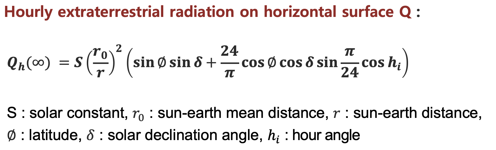
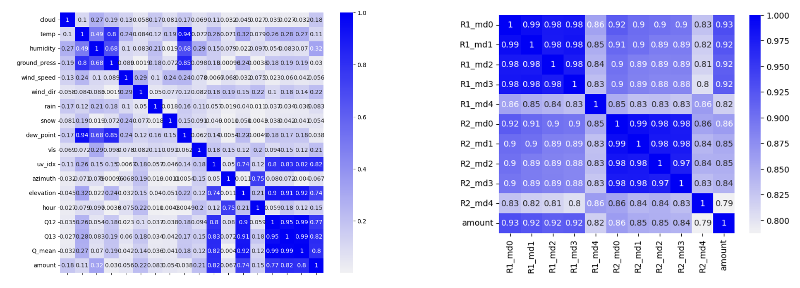
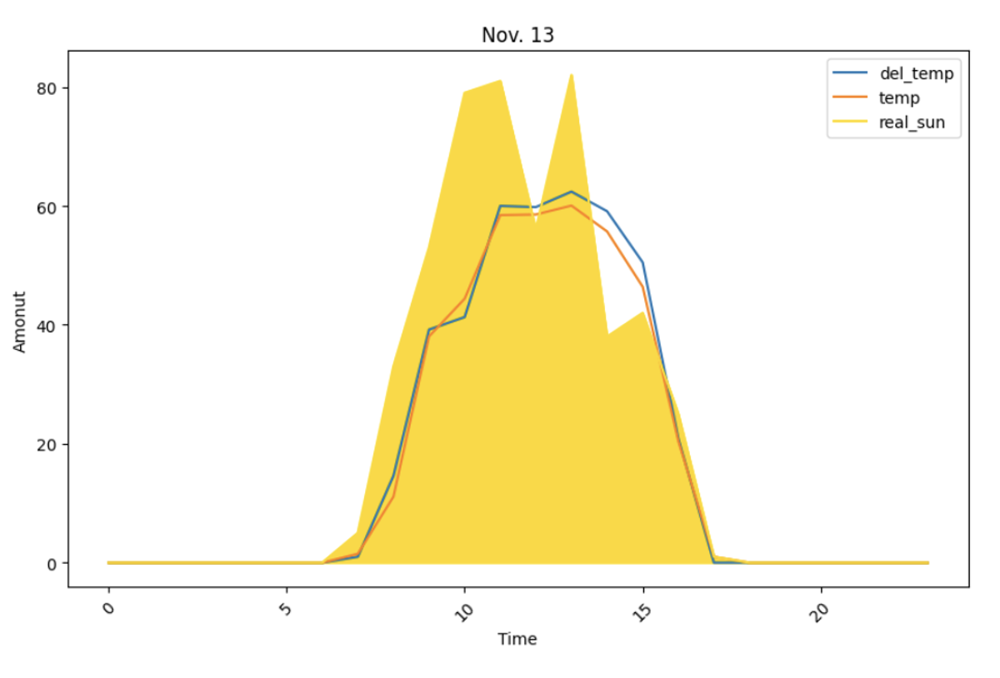
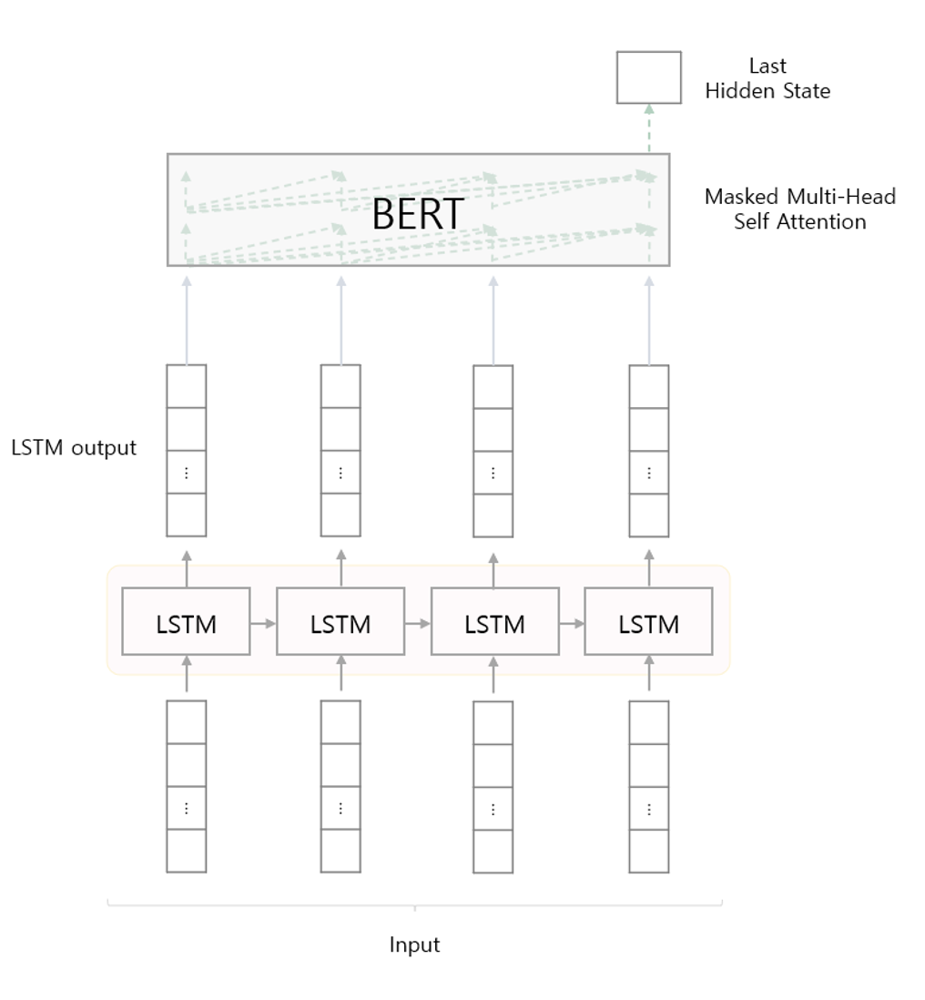
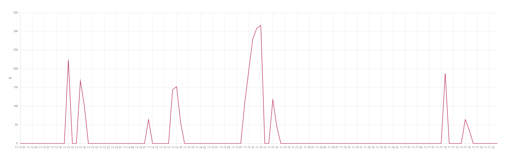
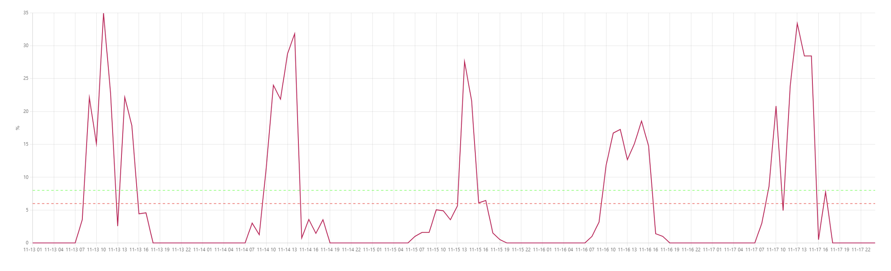
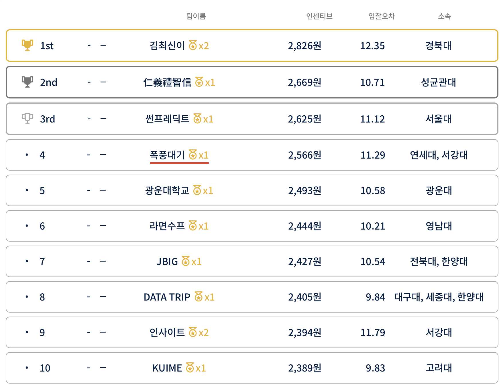
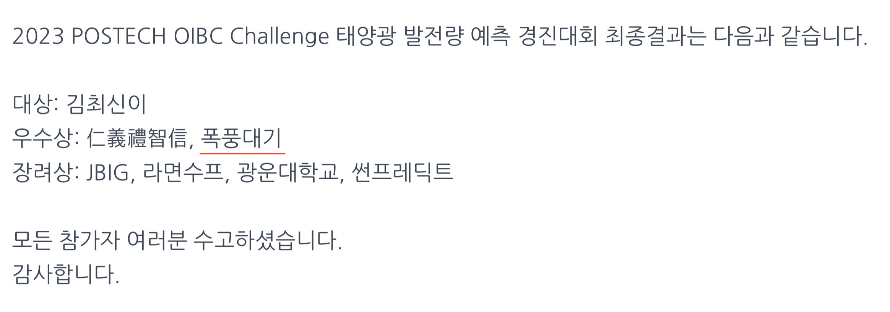

# 2023 POSTECH OIBC Challenge - Solar Power Generation Forecasting Competition

 

This is the repository for the codes used in 2023 POSTECH OIBC Challenge 

Our team(`폭풍대기`) won the Excellence Prize(3rd place, 3/120) in the [final result](https://o.solarkim.com/cmpt2023/notice), 4th place(4/120) in the [preliminary scoreboard](https://o.solarkim.com/cmpt2023/).

 

> Note: Please refer to the [comptetion website](https://competition.postech.ac.kr) for more details on the competition.

> Note: You can also refer to the [Presentation PDF](assets/OIBC_presentation.pdf) for more details on our approach.

 
 

## 1. Competition Overview

### Mission

The challenge focused on enhancing the prediction accuracy of solar power generation. Participants were tasked with developing an ensemble technique that leverages the unique characteristics of five different pre-developed solar power generation prediction models. Each of these models had its own strengths and weaknesses in terms of time-specific prediction performance.

### Data Provided

Data was provided in the following format:

- Solar Power Generation Data: Starting from June 19, 2022.
- Predictions from Five Models: Daily predictions made one day in advance (based on conditions at 10 AM and 5 PM of the previous day) from June 19, 2022, along with prediction errors and corresponding financial incentives (incentives data).
- Weather Data: Two types of meteorological data (actual and forecasted) from nearby weather stations were provided.

 
 

## 2. Our Approach

### Feature Engineering

Please refer to the [EDA notebook](EDA.ipynb) for more details on feature engineering.

#### Solar insolation Q Feature

We used the <b>solar insolation feature</b>(hourly extraterrestrial radiation on horizontal surface), which can substitute for features such as time, azimuth, and elevation. 

#### Feature Selection

We anlayzed the correlation between the features (including model predictions) and the target variable, and eliminated the features that were not correlated with the target variable.

- Selected Features: `cloud`, `humidity`, `wind_dir`, `vis`, `uv_idx`, `elevation`, `hour`, `Q13`

- Selected Model Prediction: `model0`, `model1`, `model2`, `model3`

 

> Note: We had used `temperature` feature in the early stage of the competition, but we decided to remove it because it seems to degrade the performance of the model.

 
 

### LSTM with Attention

We used LSTM with attention as our base model since LSTM is known to be effective in time series forecasting and attention mechanism can help the model to focus on the important features and address the long-term dependency problem.

 
 

## 3. Result

### Incentive

> Total incentive: 2,566 KRW

 

### Error

> Total Error: 11.29%

 

### Preliminary Scoreboard

> 4th place (4/120)

 

### Final Result

> 3rd place (3/120)

 
 

# 4. Team

<table>
    <tr height="140px">
      <td style="text-align:center">
         
      </td>
      <td style="text-align:center">
         
      </td>
      <td style="text-align:center">
         
      </td>
   </tr>
   <tr>
       <td style="text-align:center"><a href="#"><b>Jieun Shin(신지은)</b></a></td>
       <td style="text-align:center"><a href="https://github.com/SeungOkOH"><b>Seungok Oh(오승옥)</b></a></td>
       <td style="text-align:center"><a href="https://github.com/glanceyes"><b>Seonho Lee(이선호)</b></a></td>
   </tr>
   <tr>
      <td style="text-align:center">Data Preprocessing Feature Engineering</td>
      <td style="text-align:center">Data Preprocessing Team Management</td>
      <td style="text-align:center">AI Modeling Code Management</td>
   </tr>
</table>